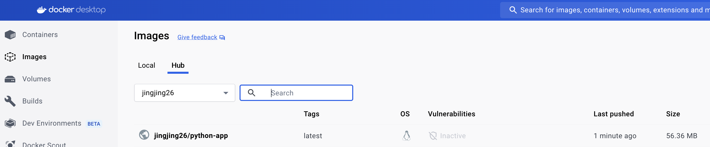
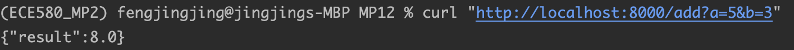

# jf361_ids706_mp12
[](https://github.com/siyiia/jf361_ids706_mp12/actions/workflows/cicd.yml)

## Project Introduction
This project is to create a Dockerized Application.

## Project Requirments
- Create a simple Python application
- Dockerize the application

## Application Functionality
This Python application is a simple calculator. You can use
```
# For addition
curl "http://localhost:8000/add?a=5&b=3"

# For subtraction
curl "http://localhost:8000/subtract?a=5&b=3"

# For multiplication
curl "http://localhost:8000/multiply?a=5&b=3"

# For division
curl "http://localhost:8000/divide?a=6&b=3"
```
Or you can directly use the url and change the value after `a` and `b` to perform different calculation.


## Project Setup
1. Implement the application functionality in `<name>.py` file
2. Test locally: 
   1. Build the Docker Image
      ```
      docker build -f <DOCKER_FILE_PATH> -t <app_name> .
      ```
   2. Run the Container and Bind Port 8000
        ```
      docker run -p 8000:8000 <app_name>
      ```
   3. Then, you can test the code by directly use the url or `curl` command.

## Screenshots
#### Scuccessful Push Docker image to Docker Hub from GitHub CI
<p>
    
</p>

#### Application Functionality Domonstration
<p>
    
</p>